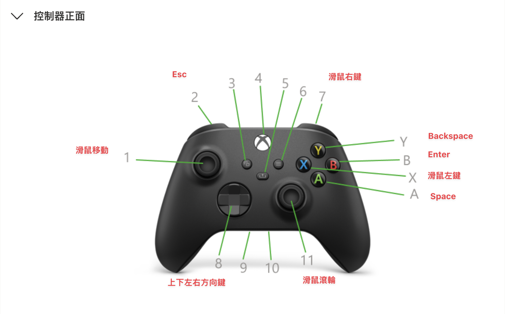
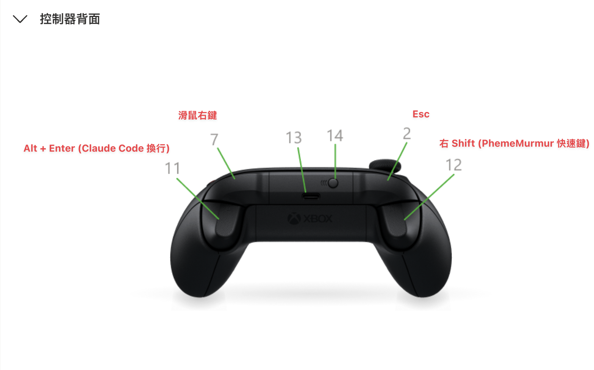

# FooTinderPad

將遊戲控制器 (Game Controller) 對應為 macOS 的鍵盤與滑鼠輸入, 讓你能用搖桿操作整個系統。

## 設定檔位置

執行期使用者設定:`~/Library/Application Support/FooTinderPad/config.json`
- 第一次啟動會用 `Resources/DefaultConfig.json` 作為初始內容
- 修改後**自動熱重載** (~100ms),不需要重啟 app
- JSON 解析失敗時會保留前一份正確設定,警告會出現在選單列

## 預設設定

```json
{
  "deadzone": 0.15,
  "mouseSpeed": 15,
  "scrollSpeed": 5,
  "bindings": {
    "buttonA": { "type": "key", "key": "Space" },
    "buttonB": { "type": "key", "key": "Return" },
    "buttonX": { "type": "mouseButton", "button": "left" },
    "buttonY": { "type": "key", "key": "Delete" },
    "leftShoulder": { "type": "key", "key": "Escape" },
    "rightShoulder": { "type": "mouseButton", "button": "right" },
    "leftTrigger": { "type": "key", "key": "RightShift" },
    "rightTrigger": { "type": "key", "key": "Alt+Return" },
    "leftThumbstickButton": { "type": "none" },
    "rightThumbstickButton": { "type": "none" },
    "dpadUp": { "type": "key", "key": "Up" },
    "dpadDown": { "type": "key", "key": "Down" },
    "dpadLeft": { "type": "key", "key": "Left" },
    "dpadRight": { "type": "key", "key": "Right" },
    "optionsButton": { "type": "none" },
    "createButton": { "type": "none" }
  },
  "leftStick": "mouse",
  "rightStick": "scroll"
}
```

## 示範設定 (易上手版)

下載: [`docs/examples/easy-preset.json`](docs/examples/easy-preset.json) — 直接覆蓋到 `~/Library/Application Support/FooTinderPad/config.json` 即可。

設計重點: 善用 PS 慣例 (Cross 確認 / Circle 取消)、讓三角 / 方塊 / 觸控板邊上的小鈕都各司其職、L2/R2 直接給最常用的複製貼上。

| 按鈕 | 對應 | 說明 |
|---|---|---|
| × Cross | 滑鼠左鍵 | PS 慣例「主要動作」 |
| ○ Circle | Escape | PS 慣例「取消/返回」 |
| ■ Square | Backspace | 文字編輯刪除 |
| △ Triangle | Space | 影片播放 / 瀏覽器捲頁 |
| L1 | LeftShift | 跟方向鍵搭配選文字, 也跟 R1 (Return) 搭配組成 Shift+Enter |
| R1 | Return | 確認 / 換行 |
| L2 | LeftCmd | 按住搭配實體鍵盤組合 Cmd 快捷鍵 |
| R2 | RightCmd | 同上, 食指搆得到的位置, 適合右手切換 app |
| L3 | Cmd+Z | Undo |
| R3 | 滑鼠右鍵 | Context menu |
| D-pad ↑↓←→ | 方向鍵 | UI 導航 / 文字游標 |
| Options (右上小鈕) | Cmd+C | 複製 (拇指容易按到, 比扳機順) |
| Create (左上小鈕) | Cmd+V | 貼上 |
| 觸控板按下 | Fn+Ctrl+Up | 呼叫 Mission Control (macOS 內建快捷鍵, 不需額外設定) |
| 左搖桿 | 滑鼠移動 | `mouseSpeed: 25` |
| 右搖桿 | 滾輪捲動 | `scrollSpeed: 5` |

### 控制器正面



### 控制器背面



## Requirements

- macOS 13 (Ventura) 以上
- Swift 5.9 以上 (Xcode 15+)
- 已配對的遊戲控制器 (Xbox / PlayStation)
- 系統設定中授予 「輔助使用 (Accessibility) 」 權限

## Install

```bash
make clean && make install
```

## 支援的控制器按鈕

下表的 key 用於 `bindings` 物件的 JSON 屬性名。沒列在 config 裡的按鈕會被當成 `none`。

| key | PlayStation | Xbox | 說明 |
|---|---|---|---|
| `buttonA` | × Cross | A | 下方面鈕 |
| `buttonB` | ○ Circle | B | 右方面鈕 |
| `buttonX` | ■ Square | X | 左方面鈕 |
| `buttonY` | △ Triangle | Y | 上方面鈕 |
| `leftShoulder` / `rightShoulder` | L1 / R1 | LB / RB | 上肩鍵 |
| `leftTrigger` / `rightTrigger` | L2 / R2 | LT / RT | 下扳機 (類比, 觸發點 0.55 / 釋放點 0.45) |
| `leftThumbstickButton` / `rightThumbstickButton` | L3 / R3 | LS / RS | 按下搖桿 |
| `dpadUp` / `dpadDown` / `dpadLeft` / `dpadRight` | 方向鍵 | 方向鍵 | |
| `optionsButton` | Options (右上小鈕) | Menu | 觸控板右上方 |
| `createButton` | Create (左上小鈕) | View | 觸控板左上方 |
| `touchpadButton` | 按下整片觸控板 | — | 僅 PS4 (DualShock4) / PS5 (DualSense) 有, Xbox 無此鈕 |

`leftStick` / `rightStick` 屬性接受 `"mouse"`、 `"scroll"`、 `"none"` 三種角色。

## 支援的按鍵

`bindings` 中使用的 key 字串 (例如 `"key": "Ctrl+Shift+A"`) 由 `KeyParser` 解析。Token 大小寫不敏感, 以 `+` 串接組合鍵。

### 修飾鍵 (Modifiers)

| 修飾鍵 | 可用別名 |
|---|---|
| Control | `ctrl`, `control`, `leftctrl`, `leftcontrol`, `rightctrl`, `rightcontrol` |
| Option / Alt | `alt`, `option`, `opt`, `leftalt`, `leftoption`, `rightalt`, `rightoption` |
| Shift | `shift`, `leftshift`, `rightshift` |
| Command / Win | `cmd`, `command`, `win`, `leftcmd`, `leftcommand`, `leftwin`, `rightcmd`, `rightcommand`, `rightwin` |
| Function | `fn` |

### 主鍵 (Main keys)

- **字母**: `a`–`z` (單字元)
- **數字**: `0`–`9`
- **功能鍵**: `f1`–`f20`
- **方向鍵**: `up`, `down`, `left`, `right`
- **編輯 / 導覽**: `space`, `return`, `tab`, `escape`, `backspace` (macOS Delete) 、 `delete` (Forward Delete) 、 `home`, `end`, `pageup`, `pagedown`
- **符號鍵**: `minus`, `equal`, `leftbracket`, `rightbracket`, `backslash`, `semicolon`, `quote`, `comma`, `period`, `slash`, `grave`

### 組合規則

- 單一 token 可以是「主鍵」 (例: `a`, `space`) 或「純修飾鍵綁定」 (例: `ctrl`, `fn`) 。
- 多 token 時, 最後一個必須是主鍵, 前面全部必須是修飾鍵, 例如 `Ctrl+Shift+A`、 `Cmd+Space`、 `Alt+Return`。
- 重複的修飾鍵會自動去重。
- 結尾若是修飾鍵 (例: `Ctrl+Shift`) 會丟出 `modifierInMainKeyPosition` 錯誤。
- 空 token (開頭、 結尾或連續的 `+`) 會丟出 `emptySeparatorComponent` 錯誤。
